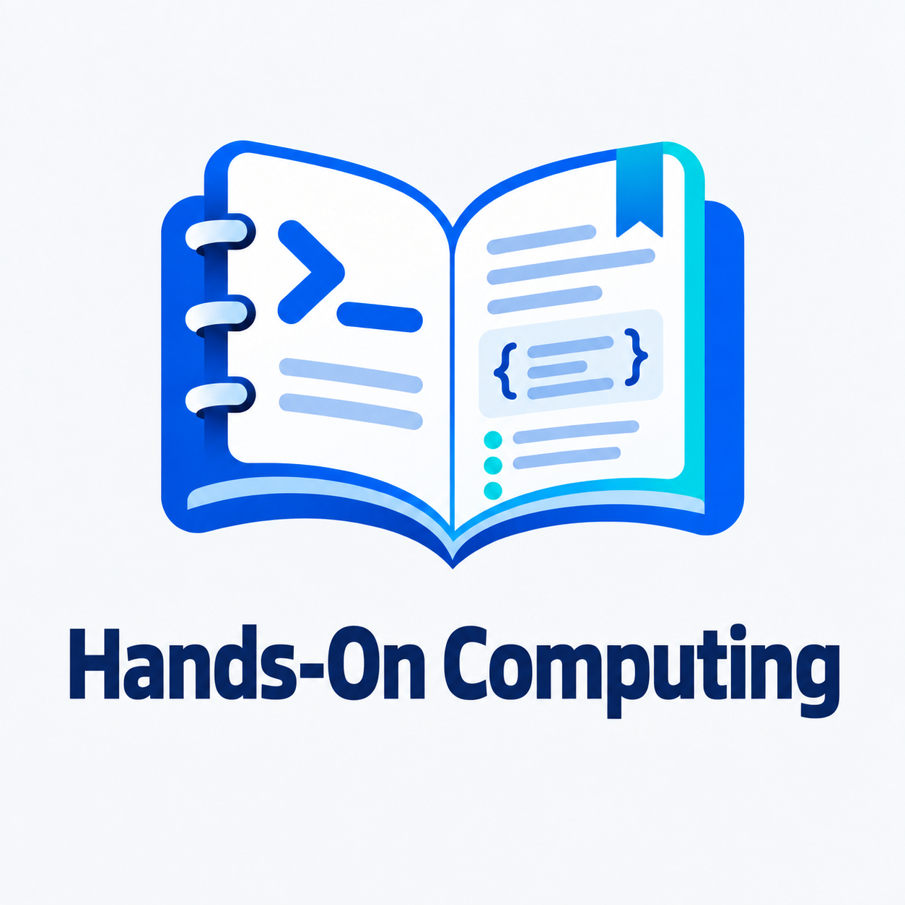
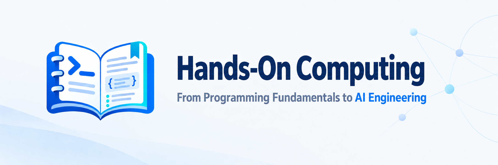

<!-- 

  <picture>
    <source media="(prefers-color-scheme: dark)" srcset="docs/assets/logo-en-dark.png">
    <source media="(prefers-color-scheme: light)" srcset="docs/assets/logo-en-light.png">
    
  </picture>

 -->

  <picture>
    <source media="(prefers-color-scheme: dark)" srcset="docs/assets/banner-en-dark.png">
    <source media="(prefers-color-scheme: light)" srcset="docs/assets/banner-en-light.png">
    
  </picture>

<h1 align="center">Hands-On Computing: From Programming Fundamentals to AI Engineering</h1>

  <a href="README.md"><strong>English</strong></a> · <a href="README.zh-CN.md">中文文档</a>
  &nbsp;
  
  
  

  <strong>
    <a href="#-motivation">Motivation</a> ·
    <a href="#-curriculum">Curriculum</a> ·
    <a href="docs/START_HERE.md">Getting Started</a> ·
    <a href="docs/project-plan.md">Roadmap</a> ·
    <a href="#-contributing">Contributing</a>
  </strong>

> [!NOTE]
> Hands-On Computing is under active development. The course notebooks and linked guides are primarily in Chinese. Corrections, suggestions, and focused pull requests are welcome.

## 🎯 Motivation

**A practical computing tutorial built around Jupyter Notebooks, starting from scratch and progressing from programming fundamentals to AI engineering.**

Hands-On Computing (`hands-on-computing`, 《动手学计算机》) follows a simple teaching principle: **understand the principles, learn by doing**. It connects programming languages, computing fundamentals, and AI applications into a coherent path for independent learners. Through explanations, code experiments, and projects, readers explore how programs run, how systems work together, and how to write, debug, test, and deploy applications.

The planned curriculum covers:

- **Programming foundations**: development environments and tools, programming languages, data structures, and algorithms to build basic programming skills.
- **Computing fundamentals**: computer systems, networks, databases, and storage to understand program execution, data organization, and communication between systems.
- **Software engineering and applications**: web and application development, testing, architecture, deployment, operations, and information security to build and maintain complete applications.
- **AI principles and applications**: mathematical foundations, machine learning, deep learning, and large models, followed by model APIs, RAG, agents, evaluation, fine-tuning, and inference deployment.

Each chapter combines explanations and code in a single Notebook, with supporting scripts, pages, and experiment resources where needed. Readers run examples, change inputs, observe results, and complete exercises. Explanations draw on official documentation, formal standards, original papers, and other primary sources, with references collected at the end of each chapter. See the [curriculum index](paths/README.md) and [project roadmap](docs/project-plan.md) for scope and plans.

## 📚 Curriculum

Start with the [getting started guide](docs/START_HERE.md), then use the [curriculum index](paths/README.md) to choose a subject and course. Each course directory's `README.md` contains environment setup and run instructions; individual chapters describe prerequisites, supporting code, and exercises.

### Programming Languages

| Course | Overview | Links |
| --- | --- | --- |
| **Python** | Start with types, functions, and objects; explore the standard library, type hints, testing, and packaging, then move on to concurrency, runtime internals, and performance analysis. | [Contents](content/编程语言/python/plan.md) |
| **JavaScript** | Learn language fundamentals, scope, closures, prototypes, and modules, then work with promises, asynchronous scheduling, automated testing, and project organization. | [Contents](content/编程语言/javascript/plan.md) |
| **TypeScript** | Build on JavaScript with type inference, narrowing, generics, and type manipulation; practice runtime validation, type testing, and package distribution. | [Contents](content/编程语言/typescript/plan.md) |

### Web and Application Development

| Course | Overview | Links |
| --- | --- | --- |
| **HTML** | Learn document structure and semantics, links, images, tables, forms, and native interactions; apply accessibility checks in a website project with multiple pages. | [Contents](content/Web与应用开发/html/plan.md) |
| **CSS** | Start with selectors, the cascade, and the box model; practice Flexbox, Grid, responsive layouts, themes, and animation through page styling exercises. | [Contents](content/Web与应用开发/css/plan.md) |

## 🤝 Contributing

Contributions are welcome: correct content or code, improve explanations and exercises, or add practical material with clear learning objectives.

- **Content feedback**: identify the file, describe the issue, and provide an official or other primary source supporting the correction.
- **Runtime feedback**: include the working directory, tool versions, reproduction steps, and error messages with sensitive information removed.
- **Writing contributions**: first read the [project collaboration rules](AGENTS.md), [Notebook writing protocol](docs/notebook-protocol.md), and any applicable directory rules. Describe the changes, checks actually performed, and anything left unverified.

See [writing and feedback](docs/START_HERE.md#编写与反馈) for more details.

## License

Original tutorials and code are licensed under [CC BY-NC-SA 4.0](LICENSE), with attribution to **CMYK Labs (cmyk-labs)**. Sharing and adaptation are permitted for non-commercial purposes under the license's attribution and ShareAlike terms. Third-party materials remain subject to their respective licenses and permissions.
