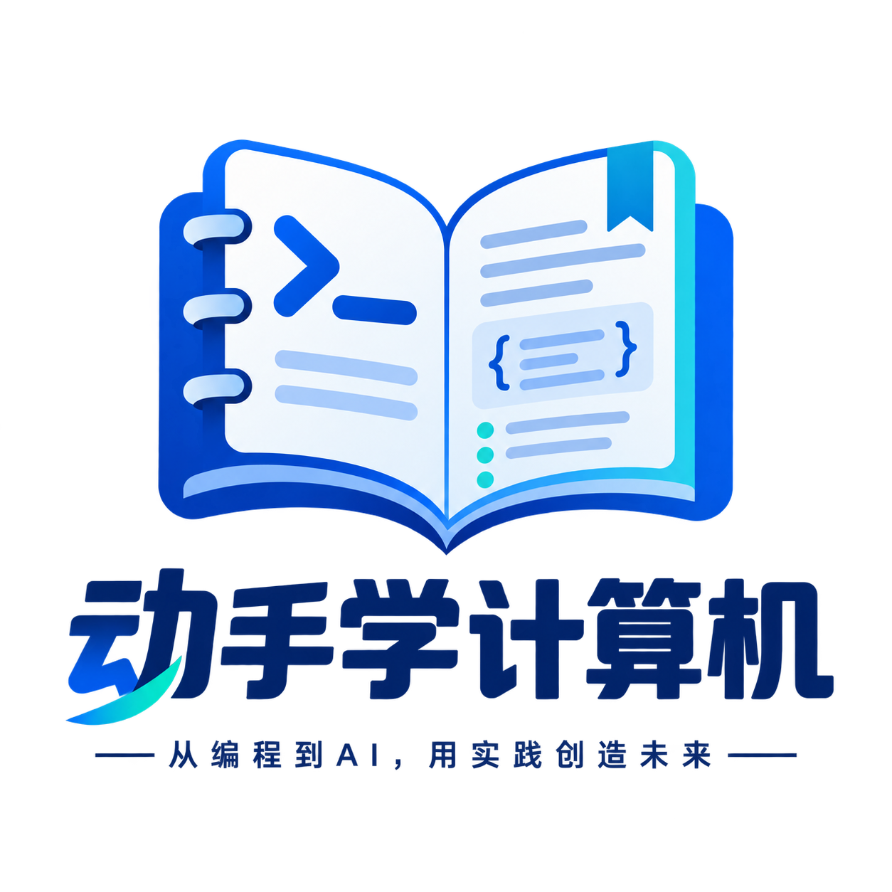

<!-- 

  

 -->

  

<h1 align="center">《动手学计算机》 从编程基础到 AI 工程</h1>

  <a href="README.md">English</a> · <a href="README.zh-CN.md"><strong>中文文档</strong></a>
  &nbsp;
  
  
  

  <strong>
    <a href="#-项目动机">项目动机</a> ·
    <a href="#-教程目录">教程目录</a> ·
    <a href="docs/START_HERE.md">开始使用</a> ·
    <a href="docs/project-plan.md">路线图</a> ·
    <a href="#-欢迎贡献">欢迎贡献</a>
  </strong>

> [!NOTE]
> 《动手学计算机》正在积极开发中。欢迎提出内容更正、改进建议，或提交聚焦具体问题的 Pull Request。

## 🎯 项目动机

**这是一套从零开始、以 Jupyter Notebook 为学习载体，从编程基础逐步走向 AI 工程的计算机实践教程。**

《动手学计算机》（`hands-on-computing`）以“理解原理，动手实践”为教学理念，把编程语言、计算机原理与 AI 应用中的知识联系起来，为自学者提供一条连贯的学习路径。通过概念讲解、代码实验和项目实践，帮助读者理解程序如何运行、系统如何协作，逐步具备独立编写、调试、测试和部署应用的能力。

课程规划覆盖以下模块：

- **编程基础**：开发环境与工具、编程语言、数据结构与算法，建立编写和运行程序的基本能力。
- **计算机原理**：计算机系统、网络、数据库与存储，理解程序执行、数据组织和系统通信的机制。
- **软件工程与应用**：Web 与应用开发、测试与架构、部署运维和信息安全，学习如何构建与维护完整应用。
- **AI 原理与应用**：数学基础、机器学习、深度学习与大模型，逐步展开模型调用、RAG、Agent、评估、微调与推理部署。

教程将讲解与代码放在同一份 Notebook 中，按需配套脚本、页面和实验资源，引导读者运行示例、修改输入、观察结果并完成练习。知识解释依据官方文档、正式标准与原始论文等第一方资料，引用集中在各篇末。详细范围与安排见[总目录索引](paths/README.md)和[项目路线图](docs/project-plan.md)。

## 📚 教程目录

首次阅读请查看[开始使用](docs/START_HERE.md)，通过[总目录索引](paths/README.md)选择学习方向与课程。环境配置与运行步骤见各课程目录的 `README.md`，前置知识、配套代码和练习要求见对应章节。

### 编程语言

| 教程内容 | 简介 | 地址 |
| --- | --- | --- |
| **Python** | 从类型、函数与对象入门，学习标准库、类型标注、测试与打包，进一步探索并发、运行机制和性能分析。 | [目录](content/编程语言/python/plan.md) · [规范](content/编程语言/python/Python编程规范.md) |
| **JavaScript** | 从语言基础理解作用域、闭包、原型与模块，掌握 Promise、异步调度、自动化测试和项目组织。 | [目录](content/编程语言/javascript/plan.md) · [规范](content/编程语言/javascript/JavaScript编程规范.md) |
| **TypeScript** | 在 JavaScript 基础上学习类型推断、收窄、泛型与类型操作，实践运行时校验、类型测试和包分发。 | [目录](content/编程语言/typescript/plan.md) · [规范](content/编程语言/typescript/TypeScript编程规范.md) |

### Web与应用开发

| 教程内容 | 简介 | 地址 |
| --- | --- | --- |
| **HTML** | 从文档结构与语义入门，学习链接、图片、表格、表单和原生交互，结合可访问性检查完成多页面网站实践。 | [目录](content/Web与应用开发/html/plan.md) · [规范](content/Web与应用开发/html/HTML编程规范.md) |
| **CSS** | 从选择器、层叠与盒模型理解样式，学习 Flexbox、Grid、响应式布局、主题和动画，完成页面样式实践。 | [目录](content/Web与应用开发/css/plan.md) · [规范](content/Web与应用开发/css/CSS编程规范.md) |

## 🤝 欢迎贡献

欢迎纠正内容与代码错误、改进讲解和练习，或补充有明确学习目标的实践。

- **内容反馈**：说明文件位置、具体问题及支持修正的官方或第一方来源。
- **运行反馈**：提供工作目录、工具版本、复现步骤和去除敏感信息后的错误信息。
- **参与编写**：先阅读[项目协作协议](AGENTS.md)、[Notebook 编写协议](docs/notebook-protocol.md)及对应技术目录的补充约定，提交改动时说明实际检查结果和未验证事项。

更多说明见[开始使用中的编写与反馈](docs/START_HERE.md#编写与反馈)。

## 许可协议

本项目的原创教程与代码采用 [CC BY-NC-SA 4.0](LICENSE)，署名 **CMYK Labs（cmyk-labs）**。允许在遵守署名和相同方式共享条款的前提下进行非商业性分享与改编。第三方材料的引用与使用遵守其各自授权。
