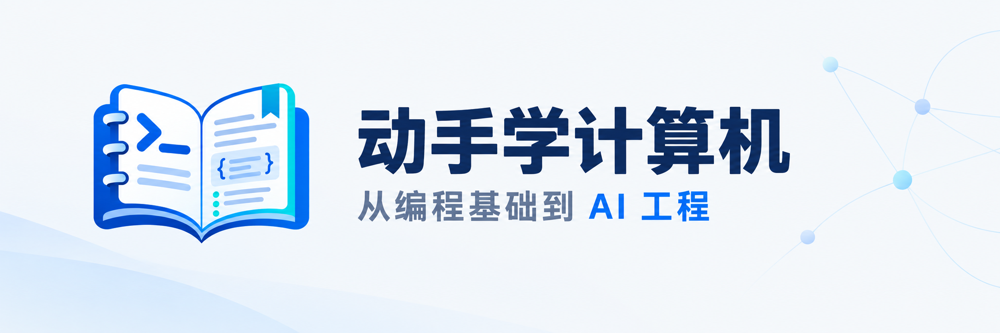

<!-- 

  <picture>
    <source media="(prefers-color-scheme: dark)" srcset="docs/assets/logo-zh-cn-dark.png">
    <source media="(prefers-color-scheme: light)" srcset="docs/assets/logo-zh-cn-light.png">
    
  </picture>

 -->

  <picture>
    <source media="(prefers-color-scheme: dark)" srcset="docs/assets/banner-zh-cn-dark.png">
    <source media="(prefers-color-scheme: light)" srcset="docs/assets/banner-zh-cn-light.png">
    
  </picture>

<h1 align="center">《动手学计算机》 从编程基础到 AI 工程</h1>

  <a href="README.md">English</a> · <a href="README.zh-CN.md"><strong>中文文档</strong></a>
  &nbsp;
  
  
  

  <strong>
    <a href="#-项目动机">项目动机</a> ·
    <a href="#-教程目录">教程目录</a> ·
    <a href="docs/START_HERE.md">开始使用</a> ·
    <a href="docs/project-plan.md">路线图</a> ·
    <a href="#-欢迎贡献">欢迎贡献</a>
  </strong>

> [!NOTE]
> 《动手学计算机》正在积极开发中。欢迎提出内容更正、改进建议，或提交聚焦具体问题的 Pull Request。

## 🎯 项目动机

**这是一套从零开始、以 Jupyter Notebook 为学习载体，从编程基础逐步走向 AI 工程的计算机实践教程。**

《动手学计算机》（`hands-on-computing`）以“理解原理，动手实践”为教学理念，把编程语言、计算机原理与 AI 应用中的知识联系起来，为自学者提供一条连贯的学习路径。通过概念讲解、代码实验和项目实践，帮助读者理解程序如何运行、系统如何协作，逐步具备独立编写、调试、测试和部署应用的能力。

课程规划覆盖以下模块：

- **编程基础**：开发环境与工具、编程语言、数据结构与算法，建立编写和运行程序的基本能力。
- **计算机原理**：计算机系统、网络、数据库与存储，理解程序执行、数据组织和系统通信的机制。
- **软件工程与应用**：Web 与应用开发、测试与架构、部署运维和信息安全，学习如何构建与维护完整应用。
- **AI 原理与应用**：数学基础、机器学习、深度学习与大模型，逐步展开模型调用、RAG、Agent、评估、微调与推理部署。

教程将讲解与代码放在同一份 Notebook 中，按需配套脚本、页面和实验资源，引导读者运行示例、修改输入、观察结果并完成练习。知识解释依据官方文档、正式标准与原始论文等第一方资料，引用集中在各篇末。详细范围与安排见[总目录索引](paths/README.md)和[项目路线图](docs/project-plan.md)。

## 📚 教程目录

首次阅读请查看[开始使用](docs/START_HERE.md)，通过[总目录索引](paths/README.md)选择学习方向与课程。环境配置与运行步骤见各课程目录的 `README.md`，前置知识、配套代码和练习要求见对应章节。

### 编程语言

| 教程内容 | 简介 | 地址 |
| --- | --- | --- |
| **Python** | 覆盖基础语法、类型与容器、字符串、流程控制、函数与闭包、面向对象、模块与包、异常与调试、文件与数据处理、迭代器、生成器、装饰器、上下文管理器、类型标注、标准库、命令行与日志、SQLite、测试与打包、并发与异步、CPython 机制、性能优化、元编程、插件与 C 扩展、自由线程、Pygame 及综合工程实践。 | [目录](content/编程语言/python/plan.md) |
| **JavaScript** | 覆盖基础语法、类型与转换、数值与字符串、流程控制、函数与闭包、对象与属性、数组与集合、this、原型与类、异常与调试、正则表达式、JSON、日期与国际化、模块、迭代器与生成器、Promise 与异步调度、测试与工程工具、二进制数据、元编程、内存与性能、显式资源管理及综合工程实践。 | [目录](content/编程语言/javascript/plan.md) |
| **TypeScript** | 覆盖工具链、基础类型与推断、数组与元组、对象与接口、联合与交叉类型、收窄、函数与重载、类型兼容性、泛型、类与枚举、类型运算与工具类型、模块解析、声明文件与声明合并、项目配置、JavaScript 迁移、运行时校验、测试与包分发、JSX、装饰器、命名空间、项目引用与编译性能及综合工程实践。 | [目录](content/编程语言/typescript/plan.md) |

### AI原理与应用

| 教程内容 | 简介 | 地址 |
| --- | --- | --- |
| **NumPy** | 覆盖数组创建、类型转换、索引筛选与重复位置更新、形状变换、视图副本与内存布局、广播与通用函数、统计聚合、排序查找与集合、随机采样、向量矩阵与张量、数值精度、线性方程与矩阵分解、数据读写与内存映射、性能与迭代、字符串与结构化数组、日期时间、掩码数组、离散数值计算、多项式、傅里叶变换、数组互操作与类型标注及综合实践。 | [目录](content/AI原理与应用/NumPy/plan.md) |
| **pandas** | 覆盖 Series 与 DataFrame、索引对齐、筛选赋值与写时复制、类型转换、缺失与重复值、统计排序与函数应用、文本与分类数据、分组聚合、连接拼接与比较、重塑与多级索引、日期时间与时区、重采样与窗口、CSV、JSON、SQL、Excel 与列式文件、数据质量与复现、内存与分块、Arrow 互操作、稀疏数据、表格展示、表达式计算及综合实践。 | [目录](content/AI原理与应用/pandas/plan.md) |
| **数据可视化** | 覆盖图形选择与视觉编码、比较与组成占比、变化与统计分布、变量关系与不确定性、层级与流向，以及 Matplotlib、Seaborn 科研绘图、Plotly、Altair、Bokeh 交互与导出和 Vega-Lite 图表规范与 Vega-Embed 网页嵌入。 | [目录](content/AI原理与应用/data-visualization/plan.md) |
| **数学基础** | 覆盖数学表达、线性代数与矩阵分解、微积分与矩阵求导、极值与凸性、概率统计推断、信息量、数值稳定性与蒙特卡洛计算、数学建模与 PCA 选学，以及变量变换、贝叶斯推断和 MCMC 扩展。 | [目录](content/AI原理与应用/mathematical-foundations/plan.md) |
| **机器学习与 scikit-learn** | 前三章样例覆盖学习任务与估计器接口、数据划分与基线、回归与分类评估；后续规划包括预处理与流水线、回归与分类算法、集成学习、模型选择、特征工程与模型解释、降维、聚类、混合模型与异常检测、半监督与在线学习、模型保存和综合实践，结合公式推导、Python 手写、scikit-learn 与部分主题的 PyTorch 对照。 | [目录与规划](content/AI原理与应用/machine-learning&scikit-learn/plan.md) |

### Web与应用开发

| 教程内容 | 简介 | 地址 |
| --- | --- | --- |
| **HTML** | 覆盖页面运行、语法与文档结构、元数据与资源引入、文本与列表、语义化结构、链接与 URL、响应式图像、音视频与嵌入内容、表格、表单与原生校验、原生交互、可访问性与检查、SVG 与 MathML、模板与插槽、解析与兼容及多页面网站实践。 | [目录](content/Web与应用开发/html/plan.md) |
| **CSS** | 覆盖语法与选择器、层叠与继承、值与单位、盒模型、正常流与溢出、颜色与背景、字体排版、列表表格与表单样式、定位与层叠上下文、Flexbox 与 Grid、媒体与容器查询、逻辑属性、主题、变换过渡与动画、样式组织、调试兼容与渲染性能、多列与打印、滤镜裁剪与蒙版、锚点定位、滚动交互及响应式页面实践。 | [目录](content/Web与应用开发/css/plan.md) |
| **FastAPI** | 覆盖 HTTP 与服务运行、路由与请求参数、请求体与数据校验、响应与异常、依赖注入、同步与异步、自动化测试、应用组织与配置、生命周期与资源管理、数据库与异步访问、中间件与跨域、认证授权、表单与文件、多进程部署、外部 HTTP 调用、后台任务、WebSocket、流式响应与 SSE、OpenAPI 与客户端生成、模板与静态资源及 API 综合交付。 | [目录](content/Web与应用开发/FastAPI/plan.md) |

## 🤝 欢迎贡献

欢迎纠正内容与代码错误、改进讲解和练习，或补充有明确学习目标的实践。

- **内容反馈**：说明文件位置、具体问题及支持修正的官方或第一方来源。
- **运行反馈**：提供工作目录、工具版本、复现步骤和去除敏感信息后的错误信息。
- **参与编写**：先阅读[项目协作协议](AGENTS.md)、[Notebook 编写协议](docs/notebook-protocol.md)及对应技术目录的补充约定，提交改动时说明实际检查结果和未验证事项。

更多说明见[开始使用中的编写与反馈](docs/START_HERE.md#编写与反馈)。

## 许可协议

本项目的原创教程与代码采用 [CC BY-NC-SA 4.0](LICENSE)，署名 **CMYK Labs（cmyk-labs）**。允许在遵守署名和相同方式共享条款的前提下进行非商业性分享与改编。第三方材料的引用与使用遵守其各自授权。
